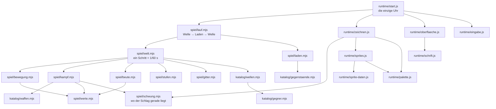

# Wegweiser

Wer hier zum ersten Mal hineinsieht, liest zuerst
[../CLAUDE.md](../CLAUDE.md), dann [SPIEL.md](SPIEL.md) — das eine sagt,
wie gearbeitet wird, das andere, was gebaut wird.

Diese Datei sagt, **wo man anfasst**. Jede Aussage hier ist aus dem Code
belegt; Zahlen, die sich ändern, stehen absichtlich nicht hier, sondern
dort, wo sie berechnet werden.

---

## Die eine Trennlinie, die alles erklärt

```
spiel/      kennt keinen Browser.  Regeln, Zahlen, Simulation.
runtime/    kennt den Browser.     Bild, Ton der Tasten, Menüs.
werkzeuge/  kennt beides nicht.    Prüfungen und Messungen.
```

`spiel/` fasst weder Bildschirm noch Tastatur noch Uhr an. Deshalb
lassen sich zwölf Wellen in Sekunden durchrechnen
(`werkzeuge/balance.mjs`), deshalb ergibt dieselbe Saat dieselbe Nacht,
und deshalb wäre Netz-Koop später billig. `werkzeuge/pruefe-kern.mjs`
hält die Linie mechanisch: ein `window` oder ein `Math.random` unter
`spiel/` macht die Kette rot.

Der Browser kommt genau in **einer** Datei vor, die etwas startet:
`runtime/start.js`.

---

## Wer redet mit wem



Alle Pfeile zeigen **von** dem, der ruft, **zu** dem, der gerufen wird.
Es gibt keinen Pfeil zurück aus `spiel/` nach `runtime/` — das ist die
Trennlinie von oben.

---

## Wo fasse ich an für …

| Wunsch | Datei |
| --- | --- |
| eine neue **Waffe** | `spiel/katalog/waffen.mjs` — ein Eintrag, keine Zeile Programm |
| einen neuen **Gegner** | `spiel/katalog/gegner.mjs` **und** ein Raster in `runtime/sprite-daten.js`; die Prüfung besteht auf beidem |
| ein neues **Fundstück** | `spiel/katalog/gegenstaende.mjs` |
| Wellen härter oder weicher | `spiel/katalog/wellen.mjs` (`budgetDerWelle`) und `gegner.mjs` (`LEBEN_JE_WELLE`) |
| eine neue Waffen**wirkung** (Brand, Frost …) | `spiel/kampf.mjs`, Abschnitt `trefferAufGegner` |
| wie ein Nahkampfschlag **aussieht und trifft** | `spiel/schwung.mjs` (Geometrie) und `bogen` im Waffenkatalog — der Zeichner rechnet nichts eigenes, das ist der Punkt |
| was ein **Wert** bewirkt | `spiel/werte.mjs` — die Rechnung steht dort **einmal** |
| Preise, Neuwürfeln, Verschmelzen | `spiel/laden.mjs` |
| Aufstiegskarten: **was auf ihnen steht** | `spiel/katalog/karten.mjs` |
| Aufstiegskarten: **wie gezogen und angewendet wird** | `spiel/stufen.mjs` |
| **Farben** und Stimmung | `runtime/palette.js` |
| wie eine Figur **aussieht** | `runtime/sprite-daten.js` |
| **Licht**, Boden, Kamera | `runtime/zeichnen.js` |
| Anzeige und Laden-Bildschirm | `runtime/oberflaeche.js` |
| die **Kartenhand** beim Aufstieg | `runtime/karten-hand.js` |
| Tastenbelegung, Gamepads | `runtime/eingabe.js` |
| die **Schrift** | `runtime/schrift.js` |

---

## Zwei Reihenfolgen, die keine Geschmackssache sind

**Im Schritt** (`spiel/welt.mjs`): `bewegeGegner` baut das Raster, und
alles danach fragt es ab. Wer die Zeilen tauscht, sucht Ziele im Raster
des vorigen Bildes — das fällt kaum auf und ist trotzdem falsch.

**Beim Zeichnen** (`runtime/zeichnen.js`): Erst die Welt, dann das
Licht darüber, **dann** die Anzeige. Die Anzeige liegt bewusst
außerhalb des Lichts; eine Lebensanzeige im Schatten wäre keine
Stimmung, sondern ein Fehler.

---

## Wie man etwas nachrechnet

```bash
node werkzeuge/pruefe-alles.mjs          # die ganze Kette
node werkzeuge/balance.mjs --tabelle     # wie schwer ist es, zu 1 bis 4
node werkzeuge/balance.mjs --laeufe 40   # ein Beispiel-Lauf im Detail
node werkzeuge/vorschau.mjs              # spielen: http://127.0.0.1:8144/
```

Der Wegweiser oben in `werkzeuge/pruefe-alles.mjs` sagt zu jeder
Prüfung, **welcher Fehler ohne sie durchkäme**. Eine Prüfung ohne
Antwort darauf gehört gelöscht.
